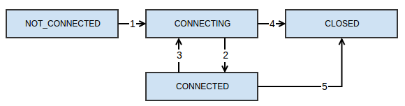
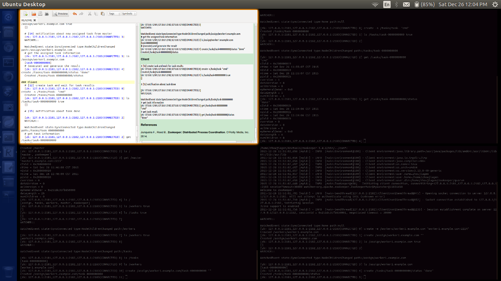

# 1 Environment setup

1 mater, 2 slaves setup locates in src/main/resources/quorum.tar.gz.

Its structure:

	.
	├── clean.sh
	├── client.sh
	├── z1
	│   ├── data
	│   │   └── myid
	│   ├── start.sh
	│   └── zoo.cfg
	├── z2
	│   ├── data
	│   │   └── myid
	│   ├── start.sh
	│   └── zoo.cfg
	└── z3
	    ├── data
	    │   └── myid
	    ├── start.sh
	    └── zoo.cfg

# 2 Foundamental concepts

## 2.1 znodes
Znode may or may not contain data, if a znode contains data, the data is stored as byte array.

## 2.2 operations on znodes

+ create /path data     
create znode `/path` with data `data`
+ delete /path  
delete znode `/path`
+ exists /path  
check existence of `/path`
+ setData /path data  
setting znode `/path` with data `data`
+ getData /path  
get data of znode `/path`
+ getChildren /path  
get children of znode `/path`

Zookeeper **clients** connect ot a Zookeeper **serive** and establish a **session** through which they make these API calls. 

Zookeeper does not allow **partial** writes or reads of the znode data.

## 2.3 modes of znodes

There are four modes of znode: `persistent`, `ephemeral`, `persistent_sequential`, `ephemeral_sequential`.

### persistent
A **persistent** znode can be deleted only through a call to `delete`.

### ephemeral
An **ephemeral** znode is deleted if the client that created it crashes(lost connection due to session expires or network error) or simply closes its connection to Zookeeper service.

### sequential
A sequential znode is assigned a unique monotonically increasing integer, and this sequence number is appended to the path used to create the znode.

## 2.4 watch and notification
Due to the limitation of **polling** mechanism, Zookeeper adopted the **notification** mechanism. Client register with Zookeeper service by setting a **watch**, to receive a **notification** for a given znode.

The **watch** is a one-shot operation, to receive notification over time, the client should set a new watch when receiving each notification.

Zookeeper supports different types of notifications, depending on how the watch was set. The client can set watches for changes of the data of znodes, changes of the children of a znode, or a znode being created or deleted.

The guarantee of the notificaiton mechanism that Zookeeper supported is that notifications **preserver the order of updates the client observes**, i.e. notifications are delivered to a client before any other changes are made to the same znode. 

## 2.5 versions
Each znode has a version number, which is incremented every time its data changes.

Some API operations, including `setData` and `delete`， can take a version parameter, these operations succeed only if the version passed matches the current version on the server.

## 2.6 quorums
Zookeeper servers run in two modes: **standalone** and **quorum**. The term Zookeper **ensemble** means an installation of servers.

In public administration, the term **quorum** is the minimum number of legislators required to be present for a vote.

In **quorum** mode, Zookeeper serive replicates its data tree across all servers in the **ensemble**.

While in Zookeper, **quorum** has several meanings. It's the minimum number of servers that have to be running and avaiable in order for Zookeeper service to work. Also, it's the minimum number of servers that have to store a client's data before telling the client successful stored result.

## 2.7 sessions
Once a client create a Zookeeper handle using a specific language binding, it establish a **session** with the service. And, all operations a client submits to Zookeeper service are associated with this session.

Considering the session with a specific Zookeeper server not the whole Zookeeper service, moving a session to a different server is handled transparently by the Zookeeper client library.

Zookeeper guarantees that requests in a session are executed in a FIFO order, while requests cross multiple sessions are not preserved in this order.

### The lifetime of a session

**transition 1**: A session starts at `NOT_CONNECTED` state and transition to `CONNECTION` with the initialization of Zookeeper client.

**transition 2**: Once the connection to Zookeeper is successfully established, then transit to `CONNECTED`.

**transition 3**: When the client loses its connection to server or does not hear from the server, it then transits back to `CONNECTING` state, and try to find another server. If the client finds another server to reconnect, then transits to `CONNECTED` state once the server confirms that the session is still valid.

**transition 4**: Follow **transition 3**, if the client cannot find another server to reconnect, then it declares the session expired and transits to `CLOSED` state.

**transition 5**: Application of Zookeeper service can explicitly close the session.

Session management and iteractions between server and client with sessions are tricky, such as session expire timeout configuration, operation confirmation across multiple sessions due to network error.

# 3 Application

## 3.1 three participants and their responsibilities
### Master
The master watches for new workers and tasks, assgins tasks to avaiable workers.

### Worker
The workers register themselves with the system to observable by the master, and then watch for taskes assigned to them.

### Client
The clients create new taskes, and wait for response from the system.

## 3.2 A sample master-work znode tree

	/
	|----/master[server id]
	|----/workers
	|----|----/worker-1[foo.com:2181]
	|----/tasks
	|----|----/task-1-2[run cmd;]
	|----/assign
	|----|----/worker-1
	|----|----|----/task-1-1[run cmd;]

## 3.3 A mock implementation using zkCli

Follow the sequence number notated by `[N]` in the comments.

**Tips** Use OS workspace switcher to opeate on different titled terminals, such as:

### System

	# [7] create system support parent znodes
	[zk: 127.0.0.1:2181,127.0.0.1:2182,127.0.0.1:2183(CONNECTED) 0] create /workers ""
	Created /workers
	[zk: 127.0.0.1:2181,127.0.0.1:2182,127.0.0.1:2183(CONNECTED) 1] create /tasks ""
	Created /tasks
	[zk: 127.0.0.1:2181,127.0.0.1:2182,127.0.0.1:2183(CONNECTED) 2] create /assign ""
	Created /assign
	[zk: 127.0.0.1:2181,127.0.0.1:2182,127.0.0.1:2183(CONNECTED) 3] ls /
	[assign, tasks, workers, master, zookeeper]

### Master

	### primary master
	# [1][6]create an ephemeral znode
	[zk: 127.0.0.1:2181,127.0.0.1:2182,127.0.0.1:2183(CONNECTED) 10] create -e /master "master1.example.com:2223"
	Created /master
	[zk: 127.0.0.1:2181,127.0.0.1:2182,127.0.0.1:2183(CONNECTED) 11] ls /
	[master, zookeeper]
	[zk: 127.0.0.1:2181,127.0.0.1:2182,127.0.0.1:2183(CONNECTED) 12] get /master
	"master1.example.com:2223"

	### backup master
	# [2]competetion for mastership
	[zk: 127.0.0.1:2181,127.0.0.1:2182,127.0.0.1:2183(CONNECTED) 0] create -e /master "master2.example.com"
	Node already exists: /master
	# [3]watch /master znode
	[zk: 127.0.0.1:2181,127.0.0.1:2182,127.0.0.1:2183(CONNECTED) 1] stat /master true

	### primary master
	# [4]close session
	[zk: 127.0.0.1:2181,127.0.0.1:2182,127.0.0.1:2183(CONNECTED) 13] quit

	### backup master
	# [5]recevied notification
	[zk: 127.0.0.1:2181,127.0.0.1:2182,127.0.0.1:2183(CONNECTED) 2] 
	WATCHER::

	WatchedEvent state:SyncConnected type:NodeDeleted path:/master

	### primary master
	# [8] watch on /workers and /tasks
	[zk: 127.0.0.1:2181,127.0.0.1:2182,127.0.0.1:2183(CONNECTED) 5] ls /workers true
	[]
	[zk: 127.0.0.1:2181,127.0.0.1:2182,127.0.0.1:2183(CONNECTED) 6] ls /tasks true
	[]

	# [10] notification of new worker registered
	[zk: 127.0.0.1:2181,127.0.0.1:2182,127.0.0.1:2183(CONNECTED) 7] 
	WATCHER::

	WatchedEvent state:SyncConnected type:NodeChildrenChanged path:/workers

	[zk: 127.0.0.1:2181,127.0.0.1:2182,127.0.0.1:2183(CONNECTED) 7] ls /workers true
	[worker1.example.com]

	# [13] notification of new task created by client
	[zk: 127.0.0.1:2181,127.0.0.1:2182,127.0.0.1:2183(CONNECTED) 8] 
	WATCHER::

	WatchedEvent state:SyncConnected type:NodeChildrenChanged path:/tasks
	# get task created by client
	[zk: 127.0.0.1:2181,127.0.0.1:2182,127.0.0.1:2183(CONNECTED) 8] ls /tasks 
	[task-0000000000]
	# see available workers
	[zk: 127.0.0.1:2181,127.0.0.1:2182,127.0.0.1:2183(CONNECTED) 9] ls /workers
	[worker1.example.com]
	# assign task to worker
	[zk: 127.0.0.1:2181,127.0.0.1:2182,127.0.0.1:2183(CONNECTED) 10] create /assign/worker1.example.com/task-0000000000 ""
	Created /assign/worker1.example.com/task-0000000000

### Worker

	# [9] register themselves
	[zk: 127.0.0.1:2181,127.0.0.1:2182,127.0.0.1:2183(CONNECTED) 0] create -e /workers/worker1.example.com "worker1.example.com:2224"
	Created /workers/worker1.example.com

	# [11] setup to accept new assigned tasks
	[zk: 127.0.0.1:2181,127.0.0.1:2182,127.0.0.1:2183(CONNECTED) 1] create /assign/worker1.example.com ""
	Created /assign/worker1.example.com
	[zk: 127.0.0.1:2181,127.0.0.1:2182,127.0.0.1:2183(CONNECTED) 2] ls /assign/worker1.example.com true
	[]

	# [14] notification about new assigned task from master
	[zk: 127.0.0.1:2181,127.0.0.1:2182,127.0.0.1:2183(CONNECTED) 3] 
	WATCHER::

	WatchedEvent state:SyncConnected type:NodeChildrenChanged path:/assign/worker1.example.com
	# get the assigned task information
	[zk: 127.0.0.1:2181,127.0.0.1:2182,127.0.0.1:2183(CONNECTED) 3] ls /assign/worker1.example.com
	[task-0000000000]
	# (execute) and generate the result
	[zk: 127.0.0.1:2181,127.0.0.1:2182,127.0.0.1:2183(CONNECTED) 4] create /tasks/task-0000000000/status "done"
	Created /tasks/task-0000000000/status

### Client
	# [12] create task and wait for task results
	[zk: 127.0.0.1:2181,127.0.0.1:2182,127.0.0.1:2183(CONNECTED) 0] create -s /tasks/task- "cmd"
	Created /tasks/task-0000000000
	[zk: 127.0.0.1:2181,127.0.0.1:2182,127.0.0.1:2183(CONNECTED) 1] ls /tasks/task-0000000000 true
	[]

	# [15] notification about task done

	[zk: 127.0.0.1:2181,127.0.0.1:2182,127.0.0.1:2183(CONNECTED) 2] 
	WATCHER::

	WatchedEvent state:SyncConnected type:NodeChildrenChanged path:/tasks/task-0000000000
	# get task information
	[zk: 127.0.0.1:2181,127.0.0.1:2182,127.0.0.1:2183(CONNECTED) 2] get /tasks/task-0000000000
	"cmd"
	# get task result
	[zk: 127.0.0.1:2181,127.0.0.1:2182,127.0.0.1:2183(CONNECTED) 3] get /tasks/task-0000000000/status
	"done"

### References
Junqueira F., Reed B.. **Zookeeper: Distributed Process Coordination**. O’Reilly Media, Inc. 2014.
